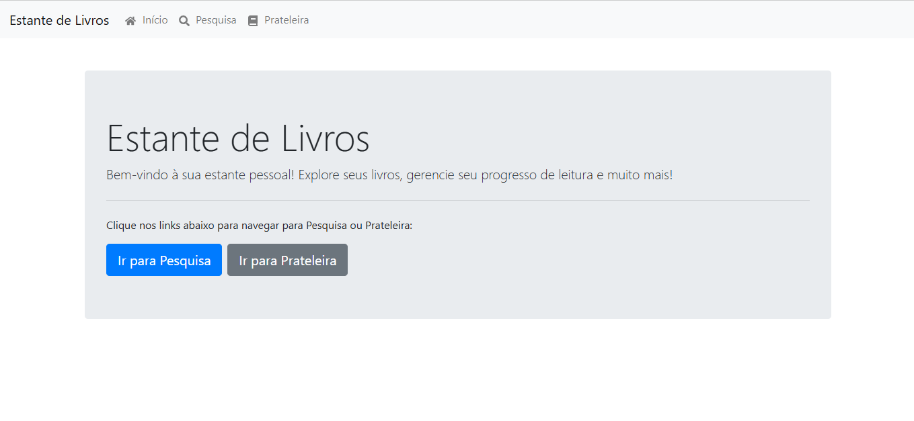
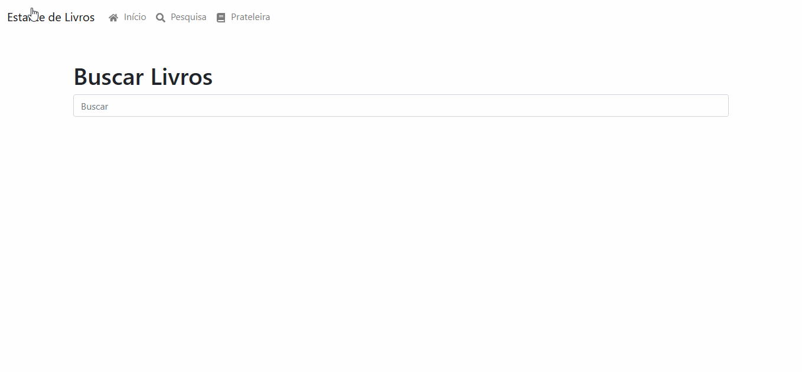
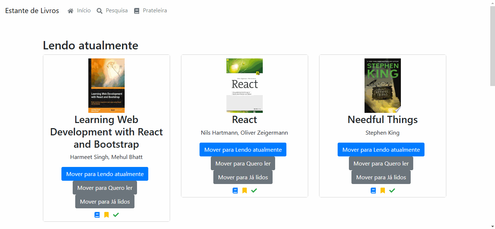

<h1><strong>Estante de Livros Online 📚</strong></h1>

        
        

Bem-vindo à <strong>Estante de Livros Online</strong>, uma aplicação moderna e intuitiva para organizar seus livros. Com uma interface simples, você pode gerenciar suas leituras, adicionar novos livros e categorizar facilmente entre "Estou lendo", "Quero ler" e "Já lido".

 
Acesse o projeto online: 
        <a href="https://luan-fb.github.io/PROJETO-ESTANTE-DE-LIVROS-ON-LINE/" target="_blank">
            Estante de Livros Online
        </a>
 

<h2><strong>📑 Índice</strong></h2>
    <ol>
        <li><a href="#descrição">Descrição</a></li>
        <li><a href="#preview">Preview</a></li>
        <li><a href="#funcionalidades">Funcionalidades</a></li>
        <li><a href="#tecnologias-utilizadas">Tecnologias Utilizadas</a></li>
        <li><a href="#sobre-as-bibliotecas-utilizadas">Sobre as Bibliotecas Utilizadas</a></li>
        <li><a href="#como-executar-o-projeto">Como Executar o Projeto</a></li>
        <li><a href="#estrutura-de-pastas">Estrutura de Pastas</a></li>
        <li><a href="#melhorias-futuras">Melhorias Futuras</a></li>
        <li><a href="#contribuidores">Contribuidores</a></li>
        <li><a href="#licença">Licença</a></li>
    </ol>

 <h2 id="descrição"><strong>📖 Descrição</strong></h2>
    
A <strong>Estante de Livros Online</strong> é uma aplicação web desenvolvida com <strong>React</strong> que permite aos usuários gerenciar seus livros em diferentes categorias:

    <ul>
        <li><strong>Estou lendo</strong></li>
        <li><strong>Quero ler</strong></li>
        <li><strong>Já lido</strong></li>
    </ul>
    
Além disso, é possível pesquisar novos livros para adicionar à sua biblioteca, personalizar as prateleiras e visualizar o progresso de leitura.

    

<h2 id="preview"><strong>🖼️ Preview</strong></h2>
    <h3>Página Inicial</h3>
    

<h3>Página de Busca</h3>
    

<h3>Movimentação de Livros</h3>
    
    

<h2 id="funcionalidades"><strong>🛠️ Funcionalidades</strong></h2>
    <ul>
        <li>📖 <strong>Gerenciar Livros:</strong> Mover livros entre categorias com facilidade.</li>
        <li>🔍 <strong>Busca Interativa:</strong> Encontre livros rapidamente usando a pesquisa dinâmica com debounce.</li>
        <li>💾 <strong>Persistência:</strong> O progresso é salvo automaticamente no navegador usando <code>localStorage</code>.</li>
        <li>🚀 <strong>Interface Responsiva:</strong> Design moderno utilizando <strong>Bootstrap</strong>.</li>
        <li>🌀 <strong>Carregamento Suave:</strong> Spinner para melhorar a experiência de busca.</li>
    </ul>

<h2 id="tecnologias-utilizadas"><strong>🔧 Tecnologias Utilizadas</strong></h2>
    <ul>
        <li><a href="https://reactjs.org/" target="_blank">React</a></li>
        <li><a href="https://getbootstrap.com/" target="_blank">Bootstrap</a></li>
        <li><a href="https://reactrouter.com/" target="_blank">React Router</a></li>
        <li><a href="https://fkhadra.github.io/react-toastify/" target="_blank">Toastify</a></li>
        <li><a href="https://axios-http.com/" target="_blank">Axios</a></li>
    </ul>
    

<h2 id="sobre-as-bibliotecas-utilizadas"><strong>📚 Sobre as Bibliotecas Utilizadas</strong></h2>

<h3>1. <a href="https://reactjs.org/" target="_blank">React</a></h3>

Biblioteca principal utilizada para construir a interface da aplicação. Permite:

<ul>
    <li>Criar componentes reutilizáveis, como prateleiras e livros.</li>
    <li>Atualizar dados dinamicamente sem recarregar a página.</li>
    <li>Gerenciar o estado de forma eficiente.</li>
</ul>

<h3>2. <a href="https://reactrouter.com/" target="_blank">React Router DOM</a></h3>

Biblioteca para navegação entre as páginas da aplicação. Oferece:

<ul>
    <li>Rotas simples e dinâmicas, como <code>/search</code> e <code>/</code>.</li>
    <li>Experiência de SPA (Single Page Application) com navegação fluida.</li>
</ul>

<h3>3. <a href="https://fkhadra.github.io/react-toastify/" target="_blank">React Toastify</a></h3>

Adiciona notificações dinâmicas para melhorar a experiência do usuário:

<ul>
    <li>Notifica sobre ações como mover livros entre categorias.</li>
    <li>Fornece feedback visual direto e intuitivo.</li>
</ul>

<h3>4. <a href="https://react-icons.github.io/react-icons/" target="_blank">React Icons</a></h3>

Biblioteca de ícones estilizados que melhora o design visual da aplicação. Permite:

<ul>
    <li>Adicionar ícones modernos em botões e ações do usuário.</li>
    <li>Personalizar o visual para uma interface mais atraente.</li>
</ul>

<h3>5. <a href="https://axios-http.com/" target="_blank">Axios</a></h3>

Biblioteca para realizar requisições HTTP. No projeto, é utilizada para:

<ul>
    <li>Integrar com a API de livros para buscar informações dinâmicas.</li>
    <li>Gerenciar requisições de forma simples e eficiente.</li>
</ul>

<h3>6. <a href="https://www.npmjs.com/package/react-scripts" target="_blank">React Scripts</a></h3>

Conjunto de ferramentas e scripts fornecidos pelo <code>create-react-app</code>. Inclui:

<ul>
    <li>Configuração de desenvolvimento e build.</li>
    <li>Otimizações para melhor desempenho da aplicação.</li>
</ul>

<h2 id="como-executar-o-projeto"><strong>⚙️ Como Executar o Projeto</strong></h2>
    <ol>
        <li>Acesse a pasta do projeto:
            <pre><code>cd PROJETO-ESTANTE-DE-LIVROS-ON-LINE</code></pre>
        </li>
        <li>Instale as dependências:
            <pre><code>npm install</code></pre>
        </li>
        <li>Inicie a aplicação:
            <pre><code>npm start</code></pre>
        </li>
        <li>Abra no navegador:
            <pre><code>http://localhost:3000</code></pre>
        </li>
    </ol>
    

    

<h2 id="estrutura-de-pastas"><strong>📂 Estrutura de Pastas</strong></h2>
 <pre><code>
src/
├── components/
│   ├── Book.js          # Exibição de livros
│   ├── Shelf.js         # Exibição de prateleiras
│   └── ShelfSelector.js # Controle para mover livros entre prateleiras
├── pages/
│   ├── HomePage.js      # Página inicial
│   ├── SearchPage.js    # Página de busca
├── utils/
│   └── utils.js         # Função de debounce
├── App.js               # Componente principal
├── index.js             # Ponto de entrada
    </code></pre>
    

   <h2><strong>Melhorias Futuras</strong></h2>
    <ul>
        <li>🌙 <strong>Tema Escuro/Claro:</strong> Adicionar suporte para temas personalizados.</li>
        <li>📊 <strong>Estatísticas de Leitura:</strong> Exibir progresso de leitura com gráficos.</li>
        <li>🔄 <strong>Sincronização:</strong> Integração com uma base de dados online para salvar o progresso.</li>
    </ul>
    

    

<h2 id="melhorias-futuras"><strong>💡 Melhorias Futuras</strong></h2>
<ul>
    <li>🌙 <strong>Tema Escuro/Claro:</strong> Fornecer um tema alternativo para melhorar a experiência do usuário em ambientes de baixa luz.</li>
    <li>📊 <strong>Estatísticas de Leitura:</strong> Apresentar gráficos detalhados sobre o progresso de leitura, como tempo médio por livro ou número de livros lidos por mês.</li>
    <li>🔄 <strong>Sincronização:</strong> Permitir que os usuários salvem suas informações em uma base de dados online para acessá-las de qualquer dispositivo.</li>
</ul>

<h2 id="contribuidores"><strong>🤝 Contribuidores</strong></h2>
    <ul>
        <li><strong>Luan Ferreira</strong> - <a href="https://github.com/luan-fb" target="_blank">GitHub</a></li>
    </ul>
    
Para dúvidas ou sugestões, entre em contato via: <a href="mailto:luanferreura1@gmail.com">Email</a>

    

<h2 id="licença"><strong>📜 Licença</strong></h2>
    
Este projeto está licenciado sob a <a href="LICENSE" target="_blank">MIT License</a>.

    

